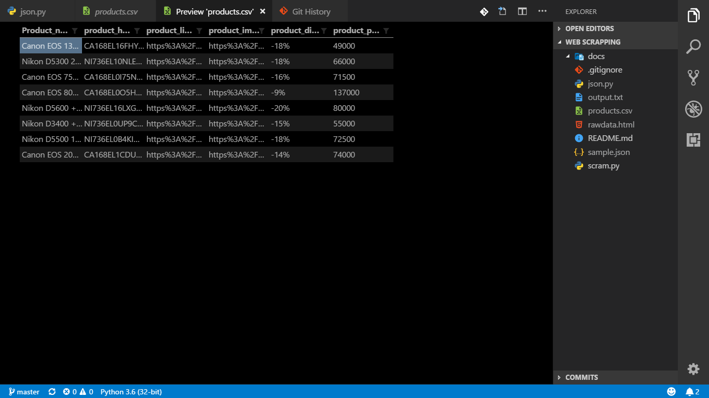
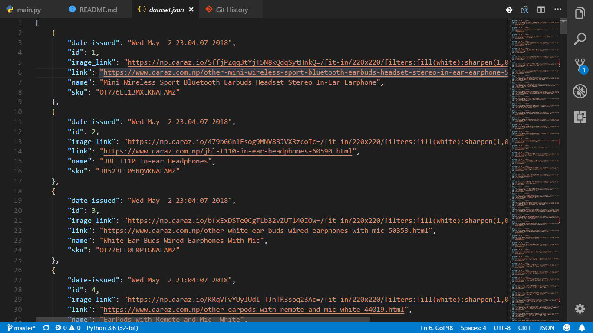

# Introduction
It is a scrapping project. It uses Python sript to scrape data from one of the page in daraz.com (i.e. DSLR section) and renders the result in a text file (output.txt).

# Skills covered
1. Scraping data from unstructed resources (like webpages)
2. Object oriented concept
3. JSON and data structure
4. Sorting and searching algorithm
5. Indexing objects in array

# How to run?
1. Run the script `main.py`.
2. Get the information from output and get your product.

# Libraries used
```python
import requests # to make HTTP requests
import urllib   # standard python URL library
import urllib.parse # parse object from standard python URL library
import json       # standard python JSON libary
import time       # standard python library for time
from bs4 import BeautifulSoup as soup   # import beautiful soup module to scrap data
```

# Output format
The script returns a CSV (Comma Separted Value) format that is used universally. This file can be opened from Microsoft Excel.


